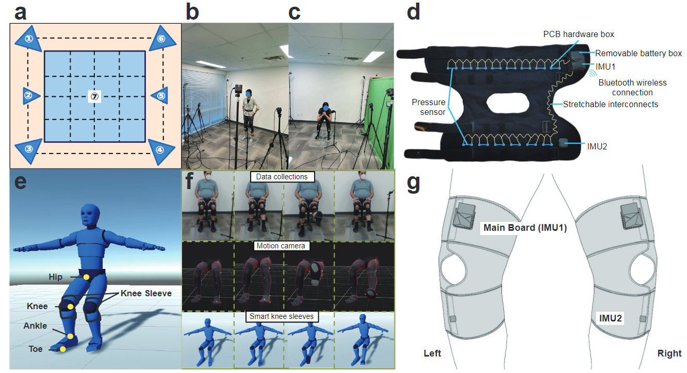
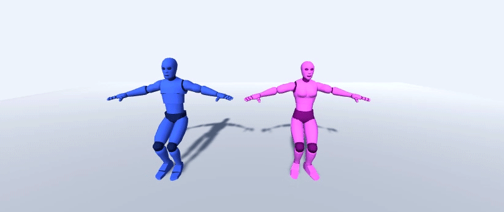

# Project Name

Intelligent Knee Sleeves: A Real-time Multimodal Dataset for 3D Lower Body Motion Estimation Using Textile Sensors



## Table of Contents

- [Introduction](#introduction)
- [Features](#features)
- [Implement](#implement )
- [Citation](#citation)
<!-- - [License](#license) -->

## Introduction

We provide a baseline for lower body pose estimation for wearable sensors: Smart Knee Sleeve embedded with IMUs and pressure sensor.

## Features

The dataset includes both ground truth from motion capture systems and synchronized data from wearable sensors. We have 14 channels of pressure sensor data and 9 channels of IMU data for each leg. Below is a simple demo for pose estimation results with 3 poses: Squatting, Hamstring curl, and Leg Raise. In the first gif, the figure from left to right is motion capture results, predictions, and app GUI separately. The pink dummy in the remaining figures is ground truth data restored directly from motion capture data while the blue dummy is visualized from the smart knee sleeve sensor values. 

<!-- {:width="60%"} -->
<!--  -->

<!--  -->
<!-- {:width="60%"} -->

<!--  -->
<!-- {:width="60%"} -->

## Implement 

please download the data [here]() and unzip it to folder ./dataset before runing the scripts. 

Implement the project by running:

```
python Train_inter.py --train_type all_seen
python Train_inter.py --train_type unseen_tasks --unseen_type bendsquat
python Train_inter.py --train_type unseen_tasks  --unseen_type hamstring
python Train_inter.py --train_type unseen_tasks  --unseen_type legraise
python Train_inter.py --train_type unseen_tasks  --unseen_type legraise_90
python Train_inter.py --train_type unseen_date --Test_day 7
python Train_inter.py --train_type unseen_people --Test_pid 1
```

Change parameters according to your requirements. 

## Citation

If you find the dataset or code useful, please cite our papers:

{}

<!-- ## License

Specify the license under which your project is distributed. For example:

This project is licensed under the [MIT License](LICENSE). -->
